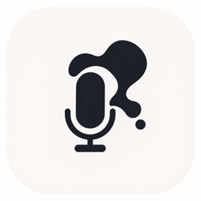

  
  <h1>VoiceInk (Derek's build)</h1>
  
Voice to text for macOS: tap a key, talk, and clean text lands in whatever app you're typing in.

  
  -brightgreen)

  

---

> **This is a modified fork of [VoiceInk by Beingpax](https://github.com/Beingpax/VoiceInk)** (GPL v3), modified by Derek Nagel, July 2026. Changes include a restyled ink UI, an Fn tap-to-toggle / hold-to-talk hybrid hotkey seeded by default, onboarding that lands a working configuration out of the box, AI cleanup via a local Claude Code CLI (no API key needed), and auto-update disabled so this build is never silently replaced. This fork is not affiliated with or supported by the upstream project.

## Install

1. Download the DMG from the [latest release](https://github.com/dnage76-beep/VoiceInk/releases/latest) and drag **VoiceInk.app** to Applications.
2. First open: right-click the app, choose **Open**, then **Open** again (this build is not notarized with Apple, so macOS asks once). If you see "Apple could not verify...", go to System Settings > Privacy & Security and click **Open Anyway**.
3. The app walks you through Microphone and Accessibility permissions. After granting Accessibility, quit and reopen VoiceInk once so the hotkey engine picks it up.
4. In onboarding, pick **Parakeet V2** as the model: fast, accurate, and runs entirely on your Mac, so audio never leaves the machine.

Requires macOS 14.4 or later on Apple Silicon.

## Features

- **Accurate local transcription**: on-device AI models transcribe speech to text almost instantly
- **Privacy first**: transcription is 100% offline; your audio never leaves your device
- **Fn hotkey**: tap to toggle recording, hold for push-to-talk (pre-configured in this build)
- **AI cleanup**: an optional second pass removes filler words, fixes grammar, and formats emails. If the `claude` command is installed, this build finds it during onboarding and enables cleanup automatically using your existing Claude subscription (transcript-only, no API key). Free Groq or Cerebras API keys also work.
- **Modes**: app-aware profiles (email, coding, texting) apply the right cleanup style automatically
- **Personal dictionary**: custom vocabulary and text replacements

## Build from Source

See [BUILDING.md](BUILDING.md). This build is produced with `make local` and signed with a local identity; it never auto-updates (deliberate: updates ship as new releases here instead).

## License

This project is licensed under the GNU General Public License v3.0. See the [LICENSE](LICENSE) file for details. Full corresponding source for every release is this repository.

## Acknowledgments

- [VoiceInk](https://github.com/Beingpax/VoiceInk) by Beingpax (Pax): the upstream project this fork is built on
- [whisper.cpp](https://github.com/ggerganov/whisper.cpp) - High-performance inference of OpenAI's Whisper model
- [FluidAudio](https://github.com/FluidInference/FluidAudio) - Used for Parakeet model implementation
- [Sparkle](https://github.com/sparkle-project/Sparkle) - Update framework (automatic checks disabled in this build)
- [KeyboardShortcuts](https://github.com/sindresorhus/KeyboardShortcuts) - User-customizable keyboard shortcuts
- [LaunchAtLogin](https://github.com/sindresorhus/LaunchAtLogin) - Launch at login functionality
- [MediaRemoteAdapter](https://github.com/ejbills/mediaremote-adapter) - Media playback control during recording
- [Zip](https://github.com/marmelroy/Zip) - File compression and decompression utilities
- [SelectedTextKit](https://github.com/tisfeng/SelectedTextKit) - A modern macOS library for getting selected text
- [Swift Atomics](https://github.com/apple/swift-atomics) - Low-level atomic operations for thread-safe concurrent programming
